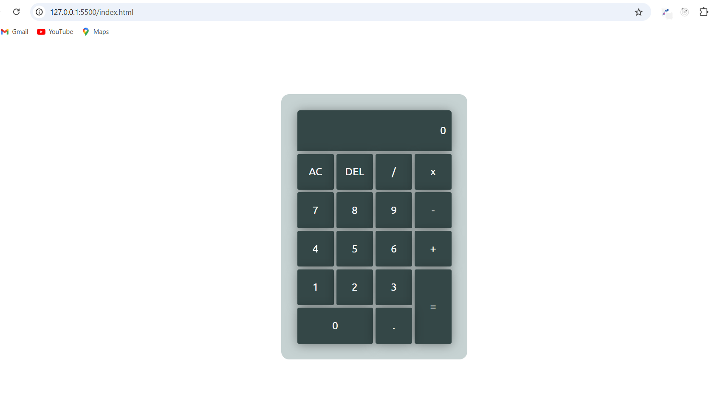

# Calculator Project

A simple calculator built using HTML, CSS, and JavaScript.

## Introduction

---

This calculator project is a basic implementation of a calculator using HTML, CSS, and JavaScript. It allows users to perform basic arithmetic operations such as addition, subtraction, multiplication, and division.

## Features

---

- Basic arithmetic operations: addition, subtraction, multiplication, and division
- Clear button to reset the calculator
- Equal button to evaluate the expression

## Technologies Used

---

- HTML: for structuring the calculator layout
- CSS: for styling the calculator
- JavaScript: for implementing the calculator logic

## How to Use

---

1. Open the `index.html` file in a web browser to use the calculator.
2. Click on the number buttons to enter numbers.
3. Click on the operator buttons to select an operation.
4. Click on the equal button to evaluate the expression.
5. Click on the clear button to reset the calculator.

## Code Structure

---

The code is structured into three main files:

- `index.html`: contains the HTML structure of the calculator
- `style.css`: contains the CSS styles for the calculator
- `main.js`: contains the JavaScript logic for the calculator

